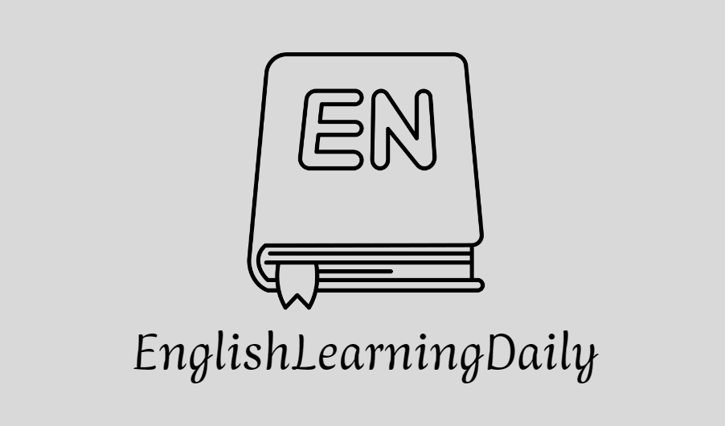

<!-- LOGO -->

 

<!-- shields -->

<h4>
  <a href="#📈-Daily Learning Progress">Daily Learning Progress</a>
   | 
  <a href="#📖-Vocabulary Learning">Vocabulary Learning</a>
</h4>

[简体中文](README.md) | <strong>English</strong> 

# 📚 EnglishLearningDaily

Welcome to my daily English learning repository! This repository is designed to help me improve my English skills by learning new words, grammar rules, and expressions every day.

## 📈 Daily Learning Progress

I will use this section to record my daily learning progress, including the number of words learned, example sentences, and related vocabulary, among other knowledge points. Through this record, I can track my learning journey and make continuous improvements.

## 📖 Vocabulary Learning

In this section, I will create individual `Markdown` files to document various words. Each word's file typically includes the following information:

- **Word**: The word itself.
- **Definition**: The meaning of the word.
- **Example Sentences**: Sentences containing the word.
- **Phrases**: Some phrases and idiomatic expressions.
- **Related Words**: Synonyms, antonyms, and associated words.

## 🤝 Participation and Contribution

I welcome other GitHub users to participate and contribute to this learning project. 🙌 You can make suggestions, correct errors, add new words and example sentences, or share your own experiences in learning English. To contribute, please follow these steps:

Fork this repository and create a new branch.
Make modifications and additions in the new branch.
Submit a Pull Request, and I will review and merge your contributions.
Thank you for your participation, and let's work together to improve our English skills! 🌟

---

Disclaimer: This repository is created for personal learning purposes and does not represent any official English learning institution or educational organization. Definitions and example sentences of words may have different interpretations; it is advisable to refer to authoritative dictionaries and grammar books for more accurate information.